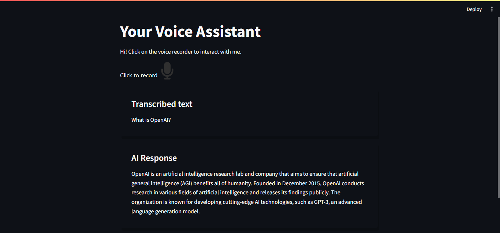

# Voice Assistant with Streamlit and OpenAI API

## Overview

This project is a voice assistant web application built using Streamlit and the OpenAI API. Users can interact with the assistant by recording their voice, which is then transcribed into text and sent to the OpenAI GPT-3.5-turbo model. The generated response is converted back to speech and played back to the user.




## Features

- **Voice Recording:** Users can record their voice using a built-in audio recorder.
- **Speech-to-Text:** The recorded audio is transcribed into text.
- **AI Response:** The transcribed text is sent as a prompt to the GPT-3.5-turbo model to generate a response.
- **Text-to-Speech:** The AI response is converted back to speech and played on the webpage.

## Installation

1. **Clone the repository:**
    ```bash
    git clone https://github.com/shevchenkkko/OpenAI-VoiceAssistant.git
    ```

2. **Create a virtual environment and activate it:**
    ```sh
    python -m venv venv
    source venv/bin/activate  # On Windows use `venv\Scripts\activate`
    ```

3. **Install dependencies:**
    Ensure you have Python installed, then install the required packages:
    ```bash
    pip install -r requirements.txt
    ```

4. **Set up the environment variables:**
    - Create a `.env` file in the root directory and add the following variables:
      ```
      OPENAI_API_KEY=your_openai_api_key
      ```

## Usage

1. **Run the Streamlit app:**
    ```bash
    streamlit run app.py
    ```

2. **If the voice recording button does not appear, click the three dots in the upper right corner and then select 'rerun'.**

3. **Interact with the Voice Assistant:**
    - Open the Streamlit app in your browser.
    - Click on the microphone button to start recording your voice.
    - Wait for the transcription and AI response.
    - Listen to the AI response played back to you.


## Contributing

Contributions are welcome! Please open an issue or submit a pull request for any improvements.

## License

This project is licensed under the MIT License.

## Contact 
For more projects, visit my [GitHub](https://github.com/shevchenkkko)
